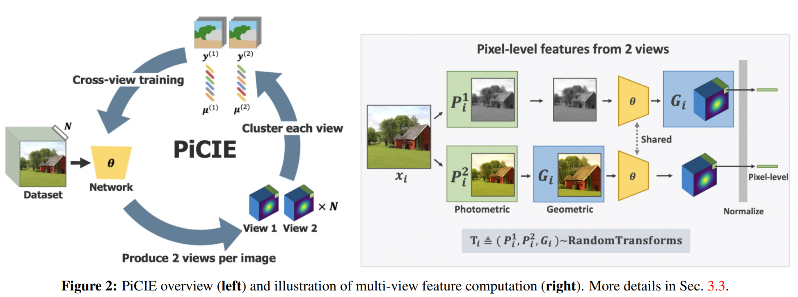

# Baseline methods: IIC, MDC and PiCIE

**Note: important file paths (for quick reference, not complete)**

## [Invariant Information Clustering (IIC)](https://github.com/xu-ji/IIC)

run: `train_iic_rgb.sh` or `train_iic_rgbd.sh`

dataset: `code/datasets/segmentation/rgb.py` or `code/datasets/segmentation/rgbd.py`

model: `code/archs/segmentation/net10a_twohead.py`
- [x] ResNet: `SegmentationNetRN50TwoHead`
- [ ] ViT: TBD

## [Pixel-level feature Clustering using Invariance and Equivariance (PiCIE)](https://github.com/janghyuncho/PiCIE)

run: `sh_files/train_picie_rgb.sh` or `sh_files/train_picie_rgbd.sh`

dataset: `data/rgb_train_dataset.py` or `data/rgbd_train_dataset.py`

model: `modules/fpn.py`
- [x] ResNet: `modules/backbone.py`
- [ ] ViT: TBD

## [Modified DeepCluster (MDC)](https://github.com/facebookresearch/deepcluster)

run: `sh_files/train_mdc_rgb.sh` or `sh_files/train_mdc_rgbd.sh`

dataset: `data/rgb_train_dataset.py` or `data/rgbd_train_dataset.py`

model: `modules/fpn.py`
- [x] ResNet: `modules/backbone.py`
- [ ] ViT: TBD